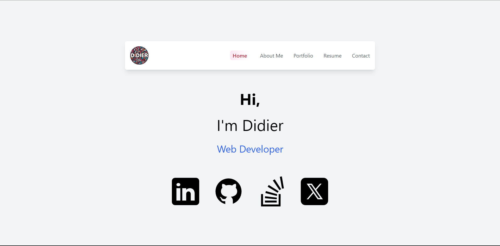

# Portfolio Website

Welcome to my personal portfolio website showcasing my work in web development,
including various projects and applications I've built.

## Table of Contents

- [Overview](#overview)
- [Technologies Used](#technologies-used)
- [Project Setup](#project-setup)
- [Netlify Deployment](#netlify-deployment)
- [Contributing](#contributing)
- [License](#license)

## Overview

This portfolio is a reflection of my skills and creativity as a developer.
It includes a collection of my projects, each with a brief description,
technology stack used, and links to live demos and the source code.

## Technologies Used

- React.js
- Tailwind CSS

## Project Setup

To set up this project locally, follow these steps:

1. Clone the repository:
   `git clone https://github.com/didierthomasm/Portfolio.git`
2. Navigate to the project directory:
   `cd Portafolio`
3. Install dependencies:
   `npm install`
4. Start the development server:
   `npm start dev`

The application should now be running on `localhost:3000`.

## Netlify Deployment

This site is also deployed on Netlify. Check out the live version here:
[Netlify Live Site](https://didierportfolio.netlify.app/)

## Contributing

Contributions are what make the open-source community such an amazing place to learn, inspire, and create. Any contributions you make are **greatly appreciated**.

1. Fork the Project
2. Create your Feature Branch (`git checkout -b feature/AmazingFeature`)
3. Commit your Changes (`git commit -m 'Add some AmazingFeature'`)
4. Push to the Branch (`git push origin feature/AmazingFeature`)
5. Open a Pull Request

## License

Distributed under the MIT License. See `LICENSE` for more information.
